# Assignment 01 — Content Presentation

**Course:** CMPS 350
**Company:** EcoMind AI
**Pages:** Home · Services · Team

---

## About the Company

EcoMind AI is an imaginary tech startup that uses artificial intelligence to help businesses reduce their environmental impact. I came up with the idea and used an LLM to help write the full content, which I saved in `content.txt`. The site has three pages: a home page with an about section and gallery, a services page with six AI-powered services, and a team page introducing four team members.

---

## Content

- [x] Generated company content using an LLM and saved it to `content.txt`
- [x] Built three pages: `index.html`, `services.html`, `team.html`
- [x] Added a navigation bar in the `<header>` that links to all three pages
- [x] Marked the current page as active using `class="active"` on the matching nav link
- [x] Added a `<footer>` with links to 6 social platforms (GitHub, LinkedIn, Twitter, Instagram, Facebook, YouTube)
- [x] The header and footer are repeated consistently across all three pages
- [x] Used semantic HTML tags: `<header>`, `<nav>`, `<main>`, `<section>`, `<article>`, `<footer>`
- [x] Added 8 gallery illustrations in the home page (`media/gallery-1.svg` through `gallery-8.svg`)
- [x] Added 4 team member avatars (`media/avatar-sara.svg`, `avatar-omar.svg`, `avatar-lina.svg`, `avatar-youssef.svg`)
- [x] Added 6 social icons in the footer (`media/icons/`)
- [x] Did not use any placeholder text — all content is real and meaningful

---

## Presentation

- [x] Imported `reset.css` in all three HTML pages before `global.css`
- [x] Defined 6 CSS custom properties in `:root`:
  - `--text` — main text color
  - `--background` — page background
  - `--backfill` — card and header background
  - `--link` — default link color
  - `--link-hover` — link hover color
  - `--link-active` — link active color
- [x] Used two custom typefaces loaded from Google Fonts:
  - **Inter** — body text
  - **Space Grotesk** — headings and header
- [x] Used `rem` and `em` units for font sizes and spacing throughout (no `px` for font sizes)
- [x] Added `:hover` pseudo-class on all anchor tags (color changes smoothly)
- [x] Added `:active` pseudo-class on all anchor tags (different color on click)
- [x] Added `::before` and `::after` pseudo-elements on `h2` to create decorative bottom borders using gradient colors
- [x] Used `@media (prefers-color-scheme: dark)` to switch to a dark color palette automatically
- [x] Added `transition: all 250ms ease` on links, service cards, team cards, and gallery images for smooth effects

---

## Layout

- [x] Wrote styles mobile-first — base styles are for small screens, then overridden at 600px
- [x] Set `main` to have a minimum width of 400px and a maximum width of 800px, centered with `margin: 0 auto`
- [x] The `<header>` spans the full viewport width
- [x] Used `box-sizing: border-box` in `reset.css` (applied universally with `*`)
- [x] **Pancake stack** pattern — `body` uses `display: flex; flex-direction: column; min-height: 100vh` so the footer stays at the bottom
- [x] **Line up** pattern — `.header-content` uses `display: flex` to put the logo and nav side by side on medium screens
- [x] **Sidebar says** pattern — `.footer-content` uses `display: grid; grid-template-columns: 1fr 2fr` on medium screens so the about text and social links sit side by side
- [x] **RAM pattern** — `.gallery-grid` and `.team-grid` both use `repeat(auto-fit, minmax(200px, 1fr))` so cards automatically wrap based on available space
- [x] Added a breakpoint at `min-width: 600px` where the layout shifts from stacked to multi-column
- [x] Images scale with their containers (`max-width: 100%` from reset.css)

---

## Screenshots

All screenshots are in the `results/` folder. I took them at three viewport widths (small ≈ 375px, medium ≈ 768px, large ≈ 1280px) in both light and dark themes.

### Home Page

| Small – Light | Small – Dark |
|---|---|
| 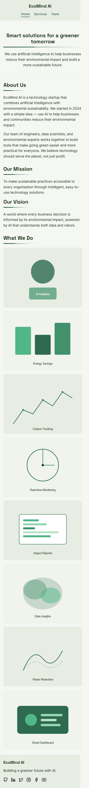 | 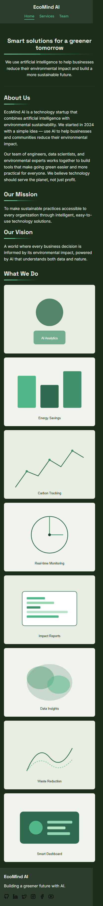 |

| Medium – Light | Medium – Dark |
|---|---|
| 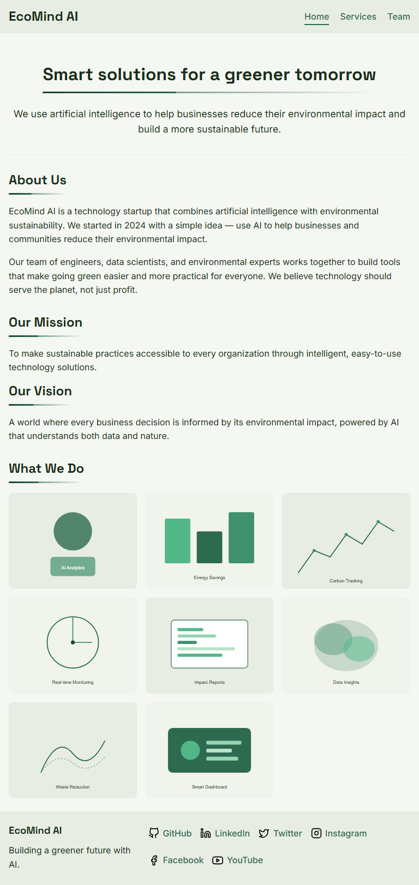 | 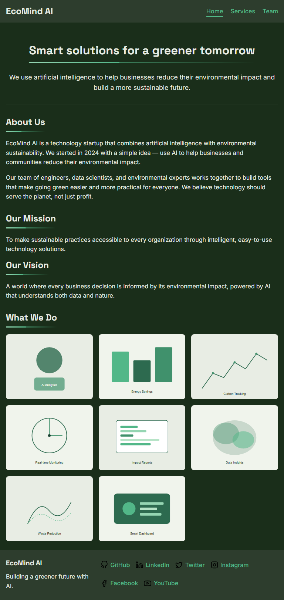 |

| Large – Light | Large – Dark |
|---|---|
| 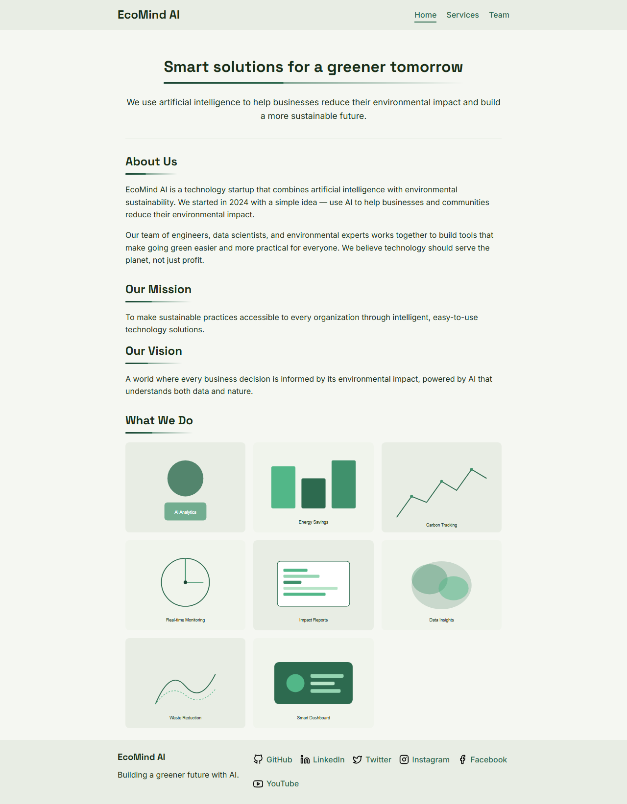 | 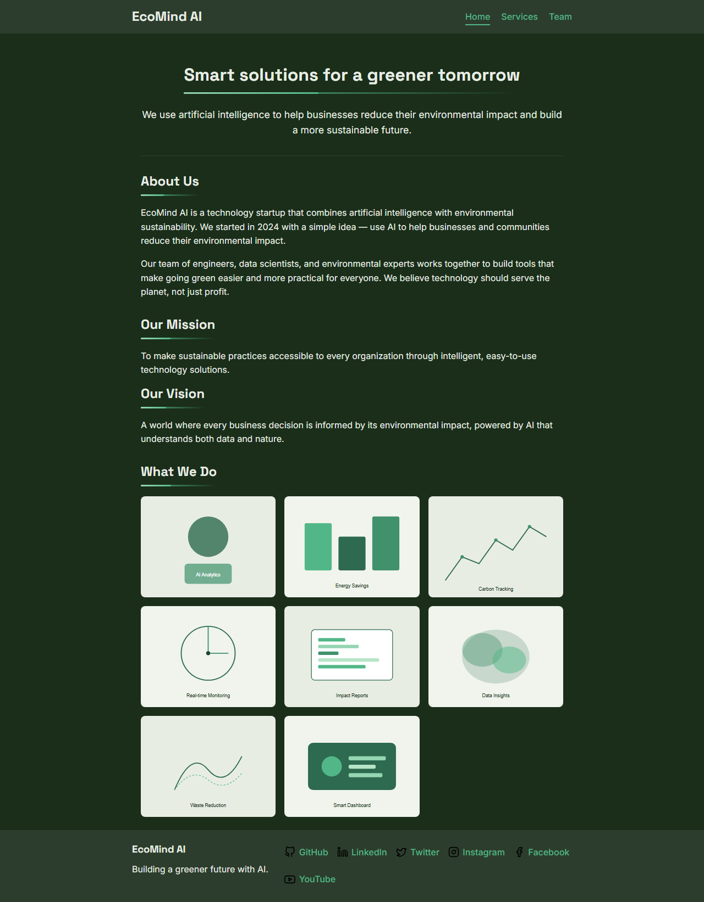 |

### Services Page

| Small – Light | Small – Dark |
|---|---|
| 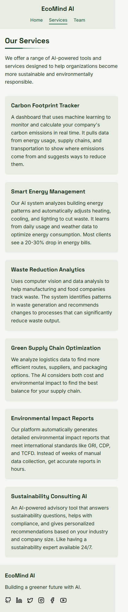 | 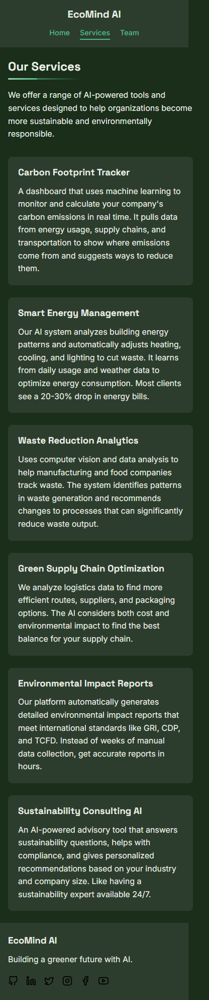 |

| Medium – Light | Medium – Dark |
|---|---|
| 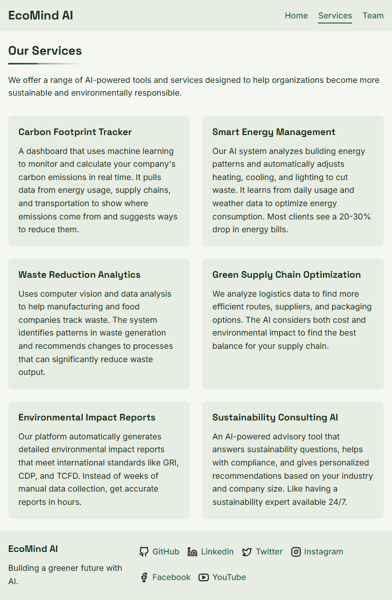 | 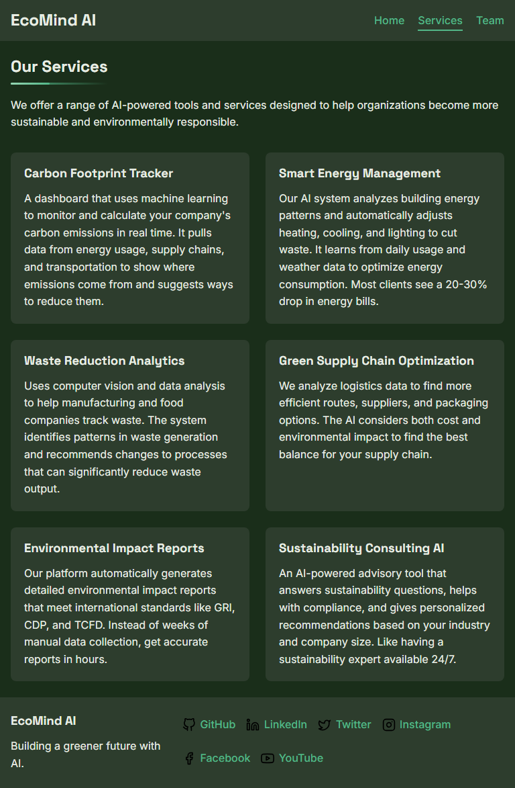 |

| Large – Light | Large – Dark |
|---|---|
| 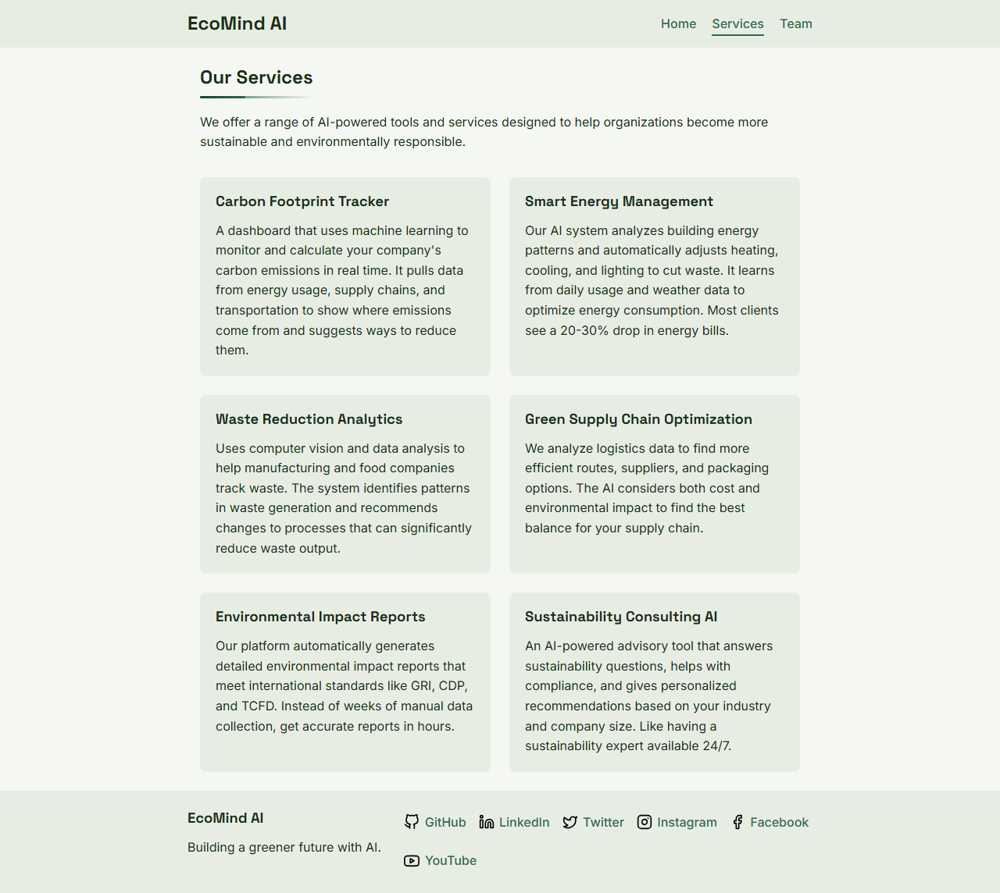 | 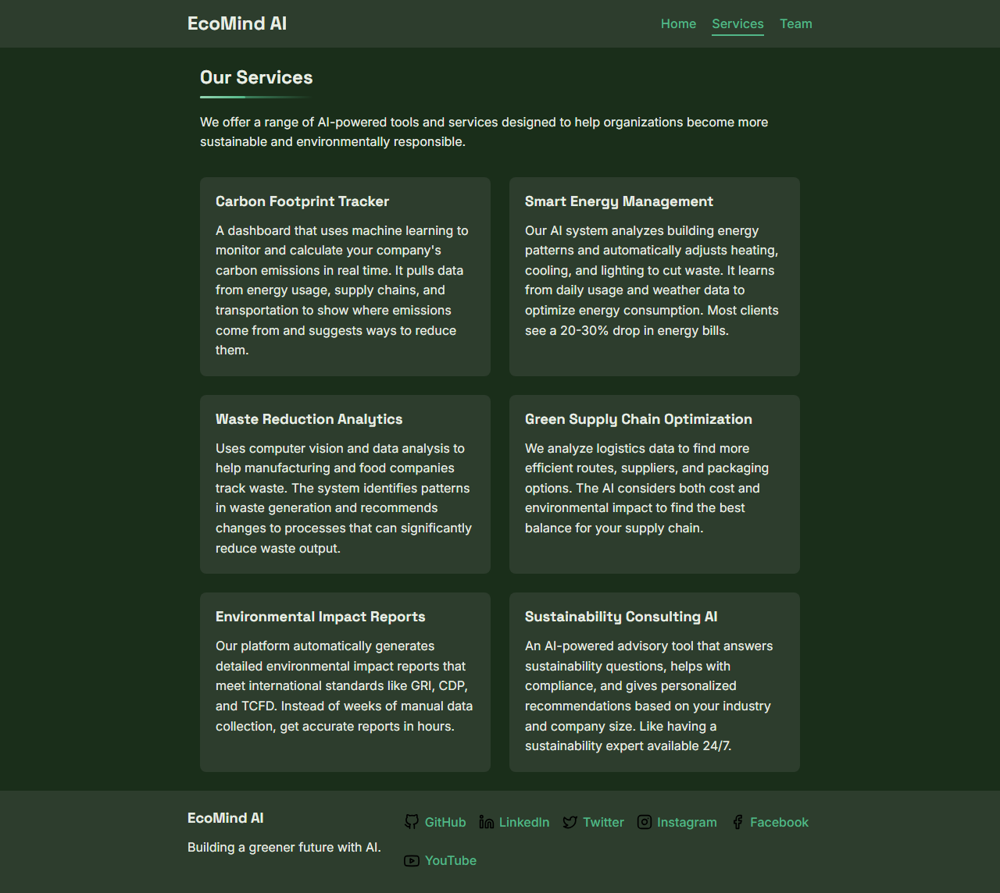 |

### Team Page

| Small – Light | Small – Dark |
|---|---|
| 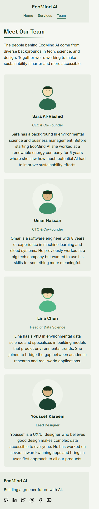 | 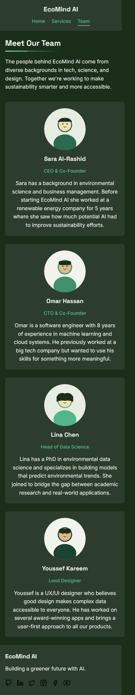 |

| Medium – Light | Medium – Dark |
|---|---|
| 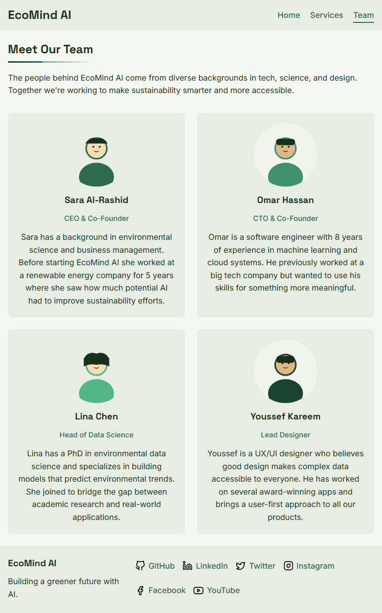 | 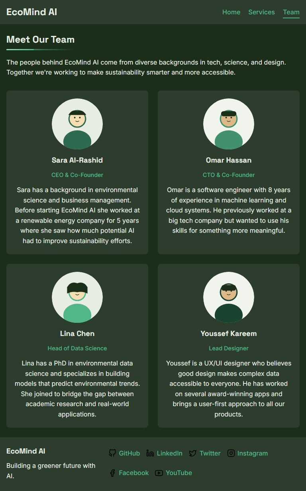 |

| Large – Light | Large – Dark |
|---|---|
| 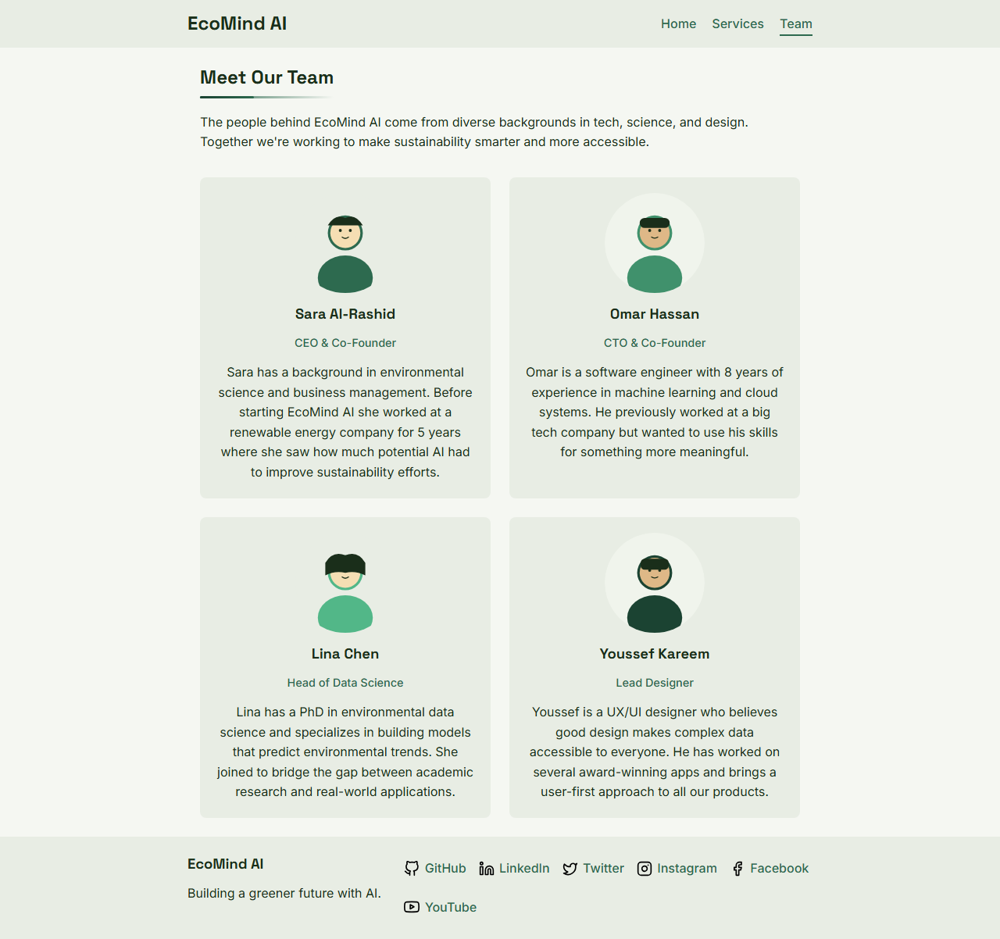 | 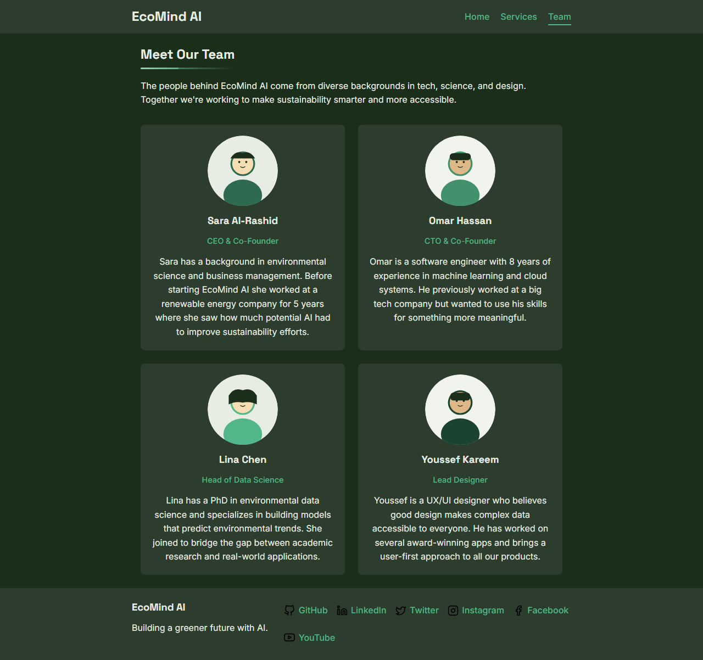 |

---

## Reflection

This was my first time building a multi-page website from scratch using only HTML and CSS. The hardest part for me was understanding the layout patterns, especially the RAM pattern with `auto-fit` and `minmax` — I had to read about it a few times before it made sense. I also found the `::before` and `::after` pseudo-elements tricky at first because I kept forgetting to set `content: ''` and `position: absolute`.

The dark mode using `prefers-color-scheme` was easier than I expected once I understood how CSS variables work — you just redefine the same variable names inside the media query and everything updates automatically.

Overall I feel like I understand flexbox and CSS grid much better after this assignment.
